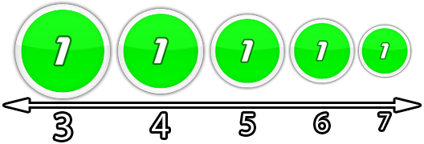

# 歌曲设置 (Song Setup) 窗口

歌曲设置是[谱面编辑器](/wiki/Client/Beatmap_editor)中的第四个部分，包含了对元数据和谱面普遍配置项的设置。

## 基本设定 (General)

### 歌曲及谱面元数据 (Song and Map Metadata)

*另见： [\[Guide\] Metadata](https://osu.ppy.sh/community/forums/topics/249288 "osu! 论坛")*

在创建其他难度前应该填好这些字段，这主要是为了确保谱面中所有难度的元数据一致。

应当以歌曲的[主要元数据源](/wiki/Beatmap/Primary_metadata_source)为来源填好艺术家、标题与来源字段。

#### 艺术家 (Artist)

**主唱乐队、歌手或创作此歌曲的艺术家及组织。**一般情况下，会自动从 MP3 文件元数据中读取此信息，但请检查一下以确保它们拼写正确。

*注意：动漫或游戏的标题属于[来源 (Source)](#来源-(source)) 字段。 Vocaloid 歌手名或公司名则属于[标签 (Tags)](#标签-(tags)) 字段。*

东西方人的名字顺序应与维基百科上表示的顺序相同（普遍来讲，出于一致性均采用西方顺序，姓放在名后面）。

此字段应该优先依照官方发布信息的形式填写。有时可以在维基百科或其他可信来源（比如 [Anime News Network](https://www.animenewsnetwork.com) 或 [MyAnimeList](https://myanimelist.net/)）中找到艺术家名。与任何非官方的来源一样，应该将其提供的信息与官方信息再三对照。如果前者提供了到官方来源的链接，请转而访问官方源。如果有疑问，请先填入目前已知的所有信息，然后发一个确认请求帖。

##### 罗马拼音艺术家名 (Romanised Artist)

**艺术家名的罗马拼写。**此字段应该按维基百科上的相同顺序填写（普遍来讲，出于一致性均采用西方顺序，姓放在名后面）。只有[艺术家 (Artist)](#艺术家-(artist))字段中含有 Unicode 字符时，此字段才可用。

#### 标题 (Title)

**歌曲标题。**一般情况下，会自动从 MP3 文件元数据中读取此信息，但请检查一下以确保它们拼写正确。

##### 罗马拼音标题名 (Romanised Artist)

**标题名的罗马拼写。** 只有[标题 (Title)](#标题-(title))字段中含有 Unicode 字符时，此字段才可用。

#### 制图者 (Beatmap Creator)

**制图者的用户名。**客户端应自动处理此字段，不允许编辑。也就是说，假定你是制图者。

*注意：[客串难度制作者](/wiki/Beatmap/Guest_difficulty)的用户名属于[难度名 (Difficulty)](#难度名-(difficulty)) 和（或） [标签 (Tags)](#标签-(tags))字段。*

#### 难度名 (Difficulty)

**谱面名称，即难度名称。**下拉列表中包含预设的几个名称：`Easy`、 `Normal`、 `Hard` 与 `Insane`。制图者可以从中选择，也可以自己输入一个。在难度名上有新意是不错的选择，但请确保玩家能够清楚地理解难度名代表的确切难度。含糊不清的难度名会惹恼玩家，并且不会上架。

此字段也可以用于指示客串难度（比如 "Larto's Hard"）。

#### 来源 (Source)

**歌曲的来源。**一般来说，这个字段仅用于动漫或游戏歌曲中，有时也用于其他作品（电影、电视、网络）的歌曲当中。

如果歌曲来源于动漫、游戏，或知名电影/电视节目，就应该在此字段中填写其来源，否则应将此字段留空。

*注意：此字段不是用来填写专辑名的。它们属于[标签 (Tags)](#标签-(tags)) 字段。*

不是所有歌曲需要填写此字段。它只是为了来自某些来源（比如视频游戏或动漫）的歌曲所设计的。常规的摇滚和流行歌曲可以将此字段留空。其他相关信息（比如专辑名或子流派信息）应该填入[标签 (Tags)](#标签-(tags)) 字段。

#### 标签 (Tags)

**用于帮助搜索的一批关键词。**通常应包含专辑名、客串难度制作者的用户名、公司名以及其他搜索此谱面时用户可能用到的关键词等。如果谱面包含合作部分（比如故事板），合作者的名字也应填写在此。

标签使用空格分隔。由于其他字段的元数据用于排序，填写此字段不是必需的；然而它对用户搜索特定谱面大有帮助。

## 谱面难度设定 (Difficulty)

 页面。右图为 osu!mania 专谱的设定页面。")

*注意：需要使用游戏模式特定的[谱面上架标准 (RC)](/wiki/Ranking_criteria) 中的可上架限定值。*

此标签页包含谱面的难度设定；每项设置都影响谱面不同方面的难度。

*注意：与标准的以 1 为精度调整相比，按下 `Shift` 键可以以 0.1 为精度精确调节数值。*

在设定项缩写后跟上数值是难度设定及其数值的常见表示方法。比如，`CS4` 和 `HP4.3` 指谱面的圆圈大小和掉血速度分别为 4 和 4.3。理论上，负的难度设定值也许看起来如此：`AR-2` 代表缩圈速度为 -2。

### 掉血速度 (HP Drain Rate)

掉血速度常缩写为 HP，决定了打击较好时恢复血量及打击不好时损失血量的速度。 HP 值范围为 0 到 10。 HP 值越高，恢复血量就越低，损失血量就越高。

在 osu! 与 osu!catch 中，这个值也影响[被动血量](/wiki/Client/Interface/Health_bar)（[休息时段](/wiki/Beatmap/Break)除外血量恒定降低的速度）。

*注意：一个串中的最后一个打击物件得到[激 (Geki)](/wiki/Gameplay/Judgement/Geki) 和[喝 (Katu)](/wiki/Gameplay/Judgement/Katu) 可以回复更多血量*。

### 圆圈大小 (Circle Size)

*注意：在 osu!taiko 中可以看到此设定，但不影响游玩。*

圆圈大小常缩写为 CS，只存在于 osu! 与 osu!catch 中。此设定决定了打击物件的大小，以及 osu!catch 中小人和水果的大小。 CS 值范围为 2 到 7； CS 值越大，打击物件就越小。CS 值最高时，打击物件会和光标一样大。

大部分谱面的 CS 值为 3 和 4，有时会用到 CS5 和 CS6 ，但几乎不会用 CS7。使用 [Hard Rock](/wiki/Gameplay/Game_modifier/Hard_Rock) 模组时可能会看到 CS7 以上的值。

可以通过手动编辑 `.osu` 文件更改 CS 为小于 2 及大于 7 的数值。

#### 按键数目 (Key Count)

按键数目又被称为键数 (Keys)，在 [osu!mania-专谱](#谱面适用模式指定-(mode-specific))中会替代 [圆圈大小 (CS)](#圆圈大小-(circle-size)) 设定。此设定的意思一目了然；它定义了使用的按键数，范围为 1 到 9。

如果选中 `Co-op mode` 复选框，就会让所选按键数加倍（从 5 开始），使按键总数为 10K (5)、 12K (6)、 14K (7)、 16K (8) 和 18K (9)。

### 缩圈速度 (Approach Rate)

*主页面：[缩圈速度 (Approach Rate)](/wiki/Beatmap/Approach_rate)*

*注意：在 osu!taiko 与 osu!mania 中可以看到此设定，但不影响游玩。主要因为这两个游戏模式都使用基于 BPM（每分钟节拍数） 的滚动速度。*

缩圈速度常缩写为 AR，只存在于 osu! 与 osu!catch 中，范围为 0 到 10； AR 值越高，打击物件的打击窗口期就越短。 AR 值指示了打击物件从出现到被点击或收集，在屏幕上停留的时间。

较高的 AR 值意味着物件在屏幕上停留的时间更少，给玩家提前准备的反应时间也就更短。反之，较低的 AR 值意味着物件在屏幕上的停留时间更长，允许反应时间更长。但如果 AR 值过低，就会导致同时出现在屏幕上的物件过多。

---

打击物件停留在屏幕上的时间（不使用模组）范围为 AR0 的 1800ms 到 AR10 的 450ms。

有四个模组在激活时可更改 AR 值：

- [Easy](/wiki/Gameplay/Game_modifier/Easy)：使 AR 值减半。（比如 AR10→AR5）
- [Hard Rock](/wiki/Gameplay/Game_modifier/Hard_Rock)：将 AR 值乘上 1.40，最多增加到 AR10。（比如 AR3→AR4.2 或 AR9→AR10）
- [Double Time](/wiki/Gameplay/Game_modifier/Double_Time)：AR 值不受影响，但由于游玩速度加快 50%，会导致物件停留的毫秒数缩短 33%。
- [Half Time](/wiki/Gameplay/Game_modifier/Half_Time)：AR 值不受影响，但由于游玩速度减慢 25%，会导致物件停留的毫秒数延长 33%。

尽管 Half Time 和 Double Time 不改变实际 AR 值，速度的不同会导致 AR 值表面上的改变，可以低达 AR-5，也可以高达 AR11。在给出的 AR 值表格中给出了这些值，以便比较是否使用模组情况下的缩圈速度。然而实际 AR 值总是在 0 到 10 之间。请注意，AR 值水准在 AR5 以下以 120ms 为步长线性增长，在 AR5 以上则为 150ms。

### 整体难度 (Overall Difficulty)

*主页面：[整体难度 (Overall difficulty)](/wiki/Beatmap/Overall_difficulty)*

*注意：上述表格只适用于 osu! 游戏模式。*\
*注意：整体难度在谱面页上被称为准度要求 (Accuracy)。*

整体难度常缩写为 OD，定义了实现高准确度的难易程度，范围为 0 到 10。 OD 值越高，对准确度和精确度的要求就越高。由于准确度对获得血量很重要，整体难度间接影响了通过谱面的难度。 OD 值越高，完成打击物件的窗口时间就更短，在一般意义上与得到最高分来说都是如此。

在 osu! 中，计时系统直到上一个物件被打击并得到判定或因错过打击窗口期而漏掉此物件后才允许打击下一个物件。如果打击窗口期太长，物件间的窗口期可能会相互重叠。在重叠段中，物件被“锁住”了，任何打击都不算数。这被非正式地称为 osu! 中的“音符锁” (notelock)，或是 osu!mania 中的 “column locking” 或 “cbrushing”。若想深入了解细节与示例，请见：[音符锁 (notelock) 相关文章](/wiki/Gameplay/Judgement/Notelock)。出于此原因，不建议在高 BPM 谱面中使用较低 OD 值。

增大 OD 值在不同游戏模式下的附加效果如下：

- osu!：填满转盘能量条所需转数增多，一直到几乎不能按时完成的程度。
- osu!taiko：完成转盘所需打击数增加。
- osu!mania 和 osu!catch 不受 OD 值影响。

若要计算打击窗口期，请见[整体难度 (OD) 相关文章](/wiki/Beatmap/Overall_difficulty)中的公式。

---

在 OD 值为 0 时，玩家可以在距准时击打物件 79.5ms 的时间内获得 300 分。在另一端情况下，OD10 需要在 19.5ms 内击打物件才能同样获得 300 分。

有四个模组在激活时可更改 OD 值：

- [Easy](/wiki/Gameplay/Game_modifier/Easy)：使 OD 值减半。
- [Hard Rock](/wiki/Gameplay/Game_modifier/Hard_Rock)：将 OD 值乘上 1.40，最多增加到 OD10。
- [Double Time](/wiki/Gameplay/Game_modifier/Double_Time)：OD 值不受影响，但由于游玩速度加快 50%，会有效导致打击窗口期缩短 33%。
- [Half Time](/wiki/Gameplay/Game_modifier/Half_Time)：OD 值不受影响，但由于游玩速度减慢 25%，会有效导致打击窗口期延长 33%。

尽管 Half Time 和 Double Time 不改变实际 OD 值，速度对打击窗口期的影响会相应让打击物件的 OD 值看起来更低或更高。在给出的 OD 值表格中给出了这些值，以便比较是否使用模组情况下的缩圈速度。请注意，这些表面上的 OD 值只适用于圆圈的 300 分得分。100 分、 50 分与滑条（使用 50 分打击窗口期）的窗口期会在启用 Double Time 模组时更严格，在启用 Half Time 模组时更宽松。对于无 Mod、 HR 和 EZ （表格左侧）也同样如此；给出的 OD 值仅供比较：实际 OD 值总是在 0 到 10 之间。

## 音效 (Audio)

 页面。如果谱面的音量设置上包含自定义计时设置，就会显示右图。")

### 默认音效设定 (Default Sample Settings)

在这里配置打击音效。此处设置在谱面全局生效；然而，制图者可以通过[测定时间轴 (timing)](/wiki/Client/Beatmap_editor/Timing) 页面（`F6`）在单独改变每个计时点处的音效集和音量。

如果在谱面中含有计时敏感的音量调整，`Sample Set Selection` 与 `Sample Set Volume` 选项就不可用。你可以点击 `Reset Settings` 来移除所有自定义的计时音量调整。

#### 音效选择(Sample Set Selection)

选择全局使用 osu! 自带的 `Normal`、 `Soft` 或 `Drum` 音效集。也可以选择[启用自定义音效覆盖](/wiki/Guides/Custom_sample_overrides)来优先将谱面文件夹内的音效文件用作自定义音效。

#### 音效音量大小(Sample Set Volume)

全局设置音效集的音量。

#### 测试音效设定(Test Sample Set)

点击不同的按钮来测试音效集的声音如何。提供了四个按钮，名字为： `Normal`、 `Whistle`、 `Finish` 和 `Clap`。这些音效是叠加的； `Whistle` 是 `Normal` 音效和 `Whistle` 音效的叠加（就是同时播放）。

### 杂项设定 (Misc. Toggles)

`Samples match playback rate (for fully-hitsounded maps)` 复选框会调整打击音效音调来与速度系数相匹配（在编辑器中与游玩中都是如此）。若取消勾选此复选框，就会以预设音调播放音效。

## 颜色 (Colors)

 标签页")

在这里配置串的颜色与游玩区域的背景颜色。

### 物件颜色 (Hitcircle/Slider Combos)

自定义每串物件的颜色。物件颜色是谱面审美价值的一个重要部分。

点击物件颜色或点击 `New Combo Colour` 会打开系统取色板（如图所示；Windows 的取色板）请选择适合背景的颜色，不要让它隐蔽到背景中。

多数谱面使用 4 种颜色，而最多可以选择 8 种颜色。

必须勾选 `Enable Custom Colours` 复选框来启用上述的自定义物件颜色。如果不勾选，就会转而使用默认的物件颜色设置，或者玩家皮肤的物件颜色设置。通常推荐勾选它，这样谱面就以物件颜色的形式拥有特别的“身份”。对于 osu!taiko 和 osu!mania 专谱，可以安全取消勾选它。

点击 `Remove Combo Color` 会移除最后一个自定义颜色。

### 谱面背景色 (Playfield Background)

点击 `Background Colour` 来改变空白游玩界面的背景颜色。

这里一直很有争议，只有通过故事板才可以展现空白游玩界面的背景。

## 设计 (Design)

### 倒计时 (Countdown)

勾选 `Enable countdown` 复选框可以启用谱面开始前的倒计时动画。

启用倒计时时，可以使用 `Countdown Speed` 单选框(`Half`, `Normal`, `Double`)与 `Countdown Offset` （默认值为 0；更高值代表倒计时更早开始）改善倒计时动画。

### 杂项设置 (Misc.Toggles)

- `Widescreen Support`：如果客户端使用的宽高比大于 `4:3`，则移除游玩区域左右两边的[侧边栏 (sidebars/pillarboxes)](https://en.wikipedia.org/wiki/Pillarbox)。当使用故事板元素时常会启用此选项，但也可将其关闭。
- `Display storyboard in front of combo file`：已被弃用，可以忽略。
- `Display epilespy warning(Storyboard has quick strobing)`：在谱面中显示对于闪烁故事板的癫痫警告。
- `Letterbox during breaks`：在谱面休息时段期间显示[黑色边框 (letterboxes)](https://en.wikipedia.org/wiki/Letterboxing_(filming))。此选项通常默认启用，但不允许在 osu!mania 专谱中使用。

### 皮肤 (Skinning)

这个选项可以设定谱面的皮肤，如果谱面要求的皮肤存在，则在玩这个谱面的时候，将自动使用该皮肤，否则将会提示用户下载，并使用默认的皮肤（即玩家正在使用的皮肤）。现在你可以将你的皮肤打包进曲包(MapSet)中，而不必要要求玩家额外下载其他的皮肤。一些老图使用了这个设定。

这是一个使用例子 [Beautiful Day - Bang! Bang! Bang! (-SiN-)](https://osu.ppy.sh/beatmapsets/10842).

## 高级 (Advanced)

### 堆叠 (Stacking)

在 osu! 中，如果打击物件时间上间隔很小，又被放在同一个点，就会自动堆叠起来。这旨在帮助玩家看到相互重叠的打击物件。

若将滑块向右移动，则会在发生堆叠前为打击物件时间上的“间隔”留下空间。最好保留此选项的默认值 `7`。

*注意： osu! 中堆叠的打击物件会朝发生堆叠的点偏移。*

如果物件所在坐标相同，且时间上的间隔不超过 `[(缩圈窗口期) * (堆叠严格度) / 10]` ，就认为它们属于同一叠。在上述公式中， `缩圈窗口期` 指的是物件在屏幕上保持显示的时长（参见上文 [缩圈速度](#缩圈速度-(approach-rate))一节）。

### 谱面适用模式指定 (Mode Specific)

`Allowed Modes` 是用于确定谱面游戏模式的下拉菜单。默认设置为 `All`，意味着制图者创建的是能被转换为其他游戏模式的谱面。可以将其切换为仅限 osu!taiko、 osu!catch 或 osu!mania；但请注意，改变此选项后会删除谱面中的所有物件。

*注意：请在创建谱面后、放置物件前先确定谱面可玩的游戏模式，以免浪费精力。*\
*注意： osu!mania 独有与常规谱面编辑器不同的编辑器。*

考虑到玩家可以用[设置](/wiki/Client/Options)中的 `osu!mania 键位排列` 按钮设置，`Use special style(N+1 style) for mania` 复选框没有实际功能。

## 杂项

- `设计 (Design)` 标签页先前被叫做 “Storyboarding” 。
- 在 `难度 (Difficulty)` 标签页中，曾出现 `星数评价 (Approximate Difficulty Rating)` 栏目，用于总结页面上所有难度设置。星星数越多，指示谱面越难。然而这并不是谱面的最终难度，只是基于目前难度设置得出的近似值。这后来被替换成一个标签，解释按住 `Shift` 键能够以 0.1 为精度精确调节各项数值。
