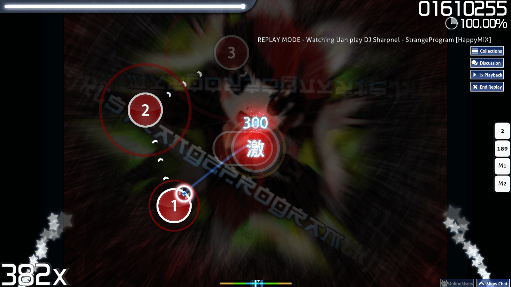

# Kiai time

*Pour les règles relatives au kiai time, consultez : [Critères de classement](/wiki/Ranking_criteria)*

::: Infobox

:::

::: Infobox

:::

Le **kiai time**, ou *kiai*, est un ensemble d'effets visuels distinctifs soulignant une section d'une [beatmap](/wiki/Beatmap), qui s'inspire[^taiko-roots] du Go-Go Time de la série [Taiko no Tatsujin](https://fr.wikipedia.org/wiki/Taiko_no_Tatsujin). Les kiai time sont indiquées par des fontaines d'étoiles, des étoiles tombant sous le curseur et des [objets](/wiki/Gameplay/Hit_object) clignotant au rythme du [BPM](/wiki/Music_theory/Tempo). Des effets similaires, tels que des éclairs latéraux fréquents et des fontaines d'étoiles, sont également visibles dans le [menu principal](/wiki/Client/Interface#main-menu).

Le kiai time n'affecte pas les mécanismes de jeu dans osu!, osu!catch ou osu!mania, mais il permet de gagner 20% de [score](/wiki/Gameplay/Score) dans [osu!taiko](/wiki/Game_mode/osu!taiko).

## Beatmapping

::: Infobox

:::

Le kiai time est le plus souvent utilisé pour la partie la plus intense d'une musique, qui est généralement le refrain ; ces sections sont typiquement plus difficiles que le reste de la beatmap. Le kiai time peut être activé pour certaines [sections de timing](/wiki/Client/Beatmap_editor/Timing) par un mappeur depuis l'onglet `Style` sur la fenêtre `Timing and Control Points`, et ne peut pas être désactivé par le joueur.

## Références

[^taiko-roots]: [Vidéo YouTube de Dean Herbert "osu! "Kiai Time" preview"](https://www.youtube.com/watch?v=1iFHftUNMrE)
